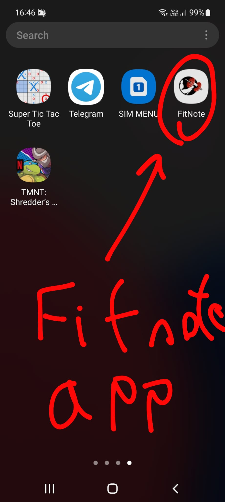

# FitNote: Exercise Tracking and Social Sharing App

FitNote is an Android application designed to help users track their exercise routines and share fitness progress with friends in a social setting.

## Features

- **Exercise Tracking**: Record various workout activities such as running, walking, cycling, weightlifting, and more.
- **Data Visualization**: View detailed statistics and visual representations of workout progress over time.
- **Social Sharing**: Share workout achievements, progress milestones, and challenges with friends and followers via whatsapp.
- **Friend Interactions**: With those messages to freinds, connect and comment on each other's activities, and provide encouragement. Compete and compare workout achievements with others.

## Screenshots

App logo


App Logo in the Android phone (samsung)



First Screen


Main Screen


Diagram Of Screens


## Installation

1. **Clone the repository:**
   ```bash
   git clone https://github.com/Alon-bdTEC/Android-app-project-FITNOTE
   ```

2. **Open in Android Studio:**
   Open the project in Android Studio and build the app.

3. **Run on Emulator or Physical Device:**
   Run the app on an emulator or connect your Android device to run FitShare.

## Usage

- Upon opening the app, create a user profile and set your fitness goals.
- Start logging your workout activities by selecting the type of exercise and entering relevant data (duration, distance, sets, reps, etc.).
- Connect with friends on FitShare and view their activities on your feed.
- Comment, like, and encourage friends on their fitness journeys.
- Track your progress through charts and graphs showcasing your workout history.

## Contributing

We welcome contributions from the community! If you'd like to contribute to FitShare, feel free to fork the repository, make your changes, and submit a pull request.

## Contributors:

This project was developed and contributed to by Alon Omer Ben David.
